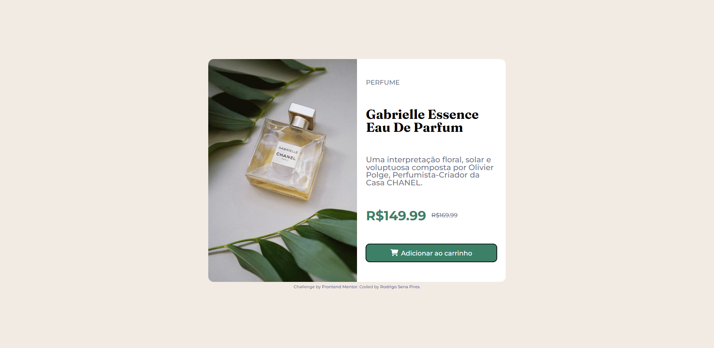

# Frontend Mentor - Solução de componente de cartão de visualização do produto

Esta é uma solução para o [desafio: cartão de visualização do produto no Frontend Mentor](https://www.frontendmentor.io/challenges/product-preview-card-component-GO7UmttRfa). Os desafios do Frontend Mentor ajudam você a melhorar suas habilidades de codificação criando projetos realistas.

## Índice

- [Visão geral](#visão geral)
  - [O desafio](#the-challenge)
  - [Captura de tela](#captura de tela)
  - [Links](#links)
- [Meu processo](#meu-processo)
  - [Construído com](#construído-com)
  - [Desenvolvimento contínuo](#desenvolvimento-contínuo)
  - [Autor](#autor)

**Observação: exclua esta nota e atualize o índice com base nas seções que você mantém.**

## Visão geral

### O desafio

Os usuários devem ser capazes de:

- Visualize o layout ideal dependendo do tamanho da tela do dispositivo
- Veja os estados de foco e foco para elementos interativos

### Captura de tela

### Links

- URL da solução: [Adicione o URL da solução aqui](https://your-solution-url.com)
- URL do site ao vivo: [Adicione o URL do site ao vivo aqui](https://your-live-site-url.com)

## Meu processo

### Construído com

- Marcação HTML5 semântica
- Propriedades personalizadas de CSS
- Flexbox
- Gride CSS
- Fluxo de trabalho mobile-first
- [Componentes estilizados](https://fontawesome.com/) - Para o ícone

### Desenvolvimento contínuo

Use esta seção para delinear as áreas nas quais você deseja continuar focando em projetos futuros. Estes podem ser conceitos com os quais você ainda não está completamente confortável ou técnicas que você achou úteis que você deseja refinar e aperfeiçoar.

Continuar praticando HTML e CSS, iniciar novos projetos, adicionando JS puro. Seguir inserindo os projetos no github, utilizando o Git Bash para
praticar com os comandos no terminal.

## Autor

- Site - [Adicione seu nome aqui](https://www.your-site.com)
- Mentor de frontend - [@seunomedeusuário](https://www.frontendmentor.io/profile/seunomedeusuário)
- Twitter - [@seunome de usuário](https://www.twitter.com/seunome de usuário)

**Observação: exclua esta nota e adicione/remova/edite as linhas acima com base nos links que deseja compartilhar.**

