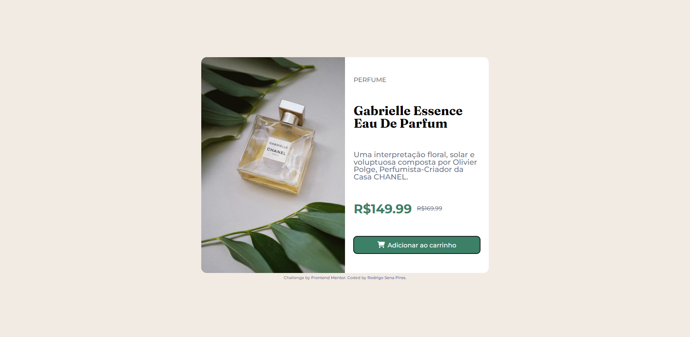

# Frontend Mentor - Solução --> Componente --> cartão de visualização do produto

Esta é uma solução para o [desafio: Componente --> cartão de visualização do produto no Frontend Mentor](https://www.frontendmentor.io/challenges/product-preview-card-component-GO7UmttRfa). Os desafios do Frontend Mentor ajudam você a melhorar suas habilidades de codificação criando projetos realistas.

## Índice

  - [O desafio](#the-challenge)
  - [Captura de tela](#captura-de-tela)
  - [Links](#links)
  - [Meu processo](#meu-processo)
  - [Construído com](#construído-com)
  - [Desenvolvimento contínuo](#desenvolvimento-contínuo)
  - [Autor](#autor)

### O desafio

Os usuários devem ser capazes de:

- Visualize o layout ideal dependendo do tamanho da tela do dispositivo
- Veja os estados de foco e foco para elementos interativos

### Captura de tela

## Desktop

## Mobile

### Links

- URL da solução: [Código](https://github.com/rodrigosenapires/produto-cartao/blob/main/index.html)
- URL do site ao vivo: [Site](https://rodrigosenapires.github.io/produto-cartao/)

## Meu processo

### Construído com

- Marcação HTML5 semântica;
- Propriedades personalizadas de CSS;
- Flexbox;
- Gride CSS;
- Fluxo de trabalho: mobile-first;
- [Componentes estilizados](https://fontawesome.com/) - Para o ícone

## Desenvolvimento contínuo

Continuar praticando HTML e CSS, iniciar novos projetos, adicionando JS puro. Seguir inserindo os projetos no github, utilizando o Git Bash para
praticar com os comandos no terminal.

## Autor

- Linkdin - [Rodrigo Sena Pires](www.linkedin.com/in/rodrigosenapires)
- Mentor de frontend - [@rodrigosenapires](https://www.frontendmentor.io/profile/seunomedeusuário)
- Github - [rodrigosenapires](https://github.com/rodrigosenapires)

